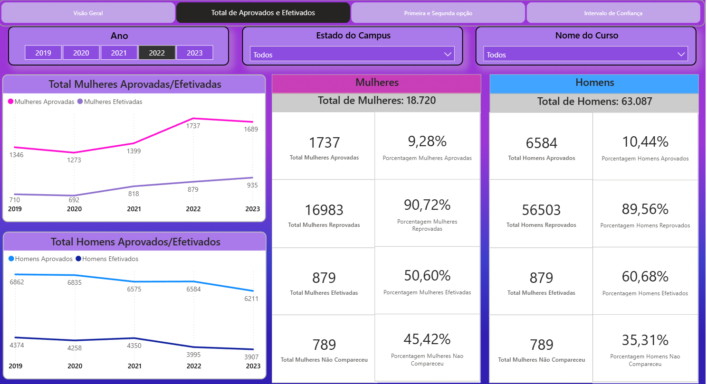

# Painel Power BI — Mulheres nos Cursos de TI (SiSU 2019-2023)

## Sobre o Projeto

Este painel interativo em Power BI investiga a **participação feminina nos cursos de Tecnologia da Informação (TI)** em universidades federais brasileiras, com base em dados do SiSU entre 2019 e 2023.

## Como foi feito

- Os dados foram extraídos de fontes públicas do **SiSU**.
- As informações da **chamada regular** foram coletadas e filtradas para alguns cursos de TI (como Ciência da Computação, Sistemas de Informação, Engenharia da Computação, entre outros).
- Um **banco de dados PostgreSQL** foi criado para consolidar os dados coletados de 2019 a 2023.
- O Power BI foi conectado ao banco para construção das visualizações e análises interativas.

## Conceitos Utilizados

- **Interessados**: candidatos que se inscreveram nos cursos (1ª ou 2ª opção)
- **Aprovados**: candidatos que atingiram a nota mínima e foram selecionados
- **Efetivados**: candidatos que realizaram a matrícula após aprovação

> A taxa de efetivação foi calculada com base no número de aprovados por gênero.

## Principais Descobertas

- O interesse feminino em cursos de TI subiu de **20% para 23%** entre 2019 e 2023.
- A efetivação das matrículas femininas também aumentou no período.
- A taxa de efetivação feminina ainda é inferior à masculina, o que pode refletir fatores como insegurança, falta de incentivo e escassez de referências femininas na área.
- Apesar disso, o desempenho acadêmico entre homens e mulheres efetivados é **estatisticamente próximo**, indicando que a diferença está mais no **acesso e permanência** do que na capacidade.

## Visualize o Painel Interativo

[Clique aqui para acessar o painel no Power BI](https://app.powerbi.com/view?r=eyJrIjoiNWU4M2M0ZDctZjFhMi00Mzk3LTlhMjctYjE0NjRiZGQxMjZiIiwidCI6ImJmN2UwZjYwLTVhMjktNDk4Ny1iNzA5LWYxYWIyODhmNjM4NSJ9)

## 🛠️ Tecnologias Utilizadas

- PostgreSQL (modelagem e integração dos dados)
- Power BI (análise e visualização)
- Power Query / DAX

## 👩‍💻 Autora

**Victória Araújo**  
[LinkedIn](https://www.linkedin.com/in/maria-victoria-araujo)

> Projeto autoral com fins exploratórios e educacionais.  
> Os dados representam uma amostra significativa, mas não abrangem todos os cursos ou instituições do país.
